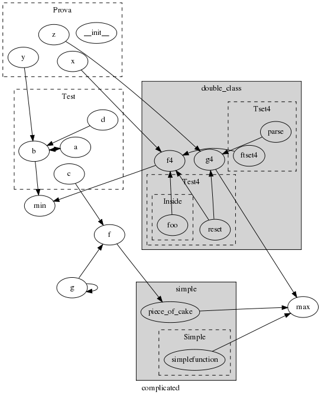

Py2Dot
======

[py2dot][] is a python script to generate a dot file from a python script.

The above picture is a typical [py2dot][] output created with the command:

	py2dot.py -r1 -i -f examples/classes/complicated.py | fdp -Tpng -o complicated.png

Functions are represented by ellipsis, arrows represent function calls, classes are in dashed boxes and imported files in gray boxes.
the output dot file can be viewed with a program like [graphviz][].

Documentation is available [here][doc]

[py2dot]: http://pypi.python.org/pypi/py2dot/
[doc]: http://packages.python.org/py2dot/
[graphviz]: http://www.graphviz.org/
